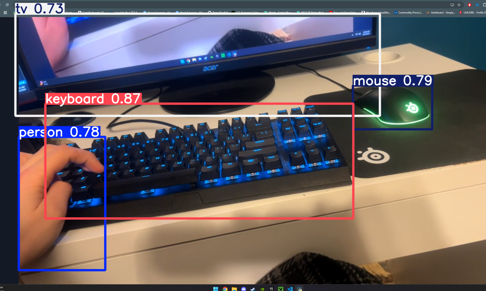

# Virtual AI Tracker Node

This is a high-performance computer vision pipeline I built to turn a standard smartphone into a localized AI tracking node. This project is a proof of concept designed to test and refine tracking logic before it is applied to a Eufy security camera system and, eventually, an autonomous drone project further down the line.

The system streams live video from a mobile device over a local Wi-Fi network to a PC. A hardware-accelerated YOLO model handles real-time object detection and tracking locally. I built this for local networks specifically to ensure near-zero latency and total data privacy by keeping the processing off the cloud.

## Project Roadmap
* Phase 1 (Current): Proof of concept using mobile hardware as a wireless IP node.
* Phase 2 (Planned): Integration with Eufy S330 hardware via local RTSP streaming.
* Phase 3 (Planned): Deployment of optimized tracking logic to an autonomous drone system.

## Key Features
* Mobile-to-PC Streaming: Uses mobile hardware as a wireless IP camera to test tracking algorithms.
* Hardware-Accelerated AI: Utilizes PyTorch and NVIDIA CUDA to run inference on a local GPU.
* Zero-Cloud Architecture: 100 percent of the processing stays on the local machine.
* Secure Environment Configuration: Decouples network credentials from the codebase using .env files for better security practices.

## Tech Stack
* Language: Python 3
* Vision and AI: OpenCV, Ultralytics YOLOv8
* Network: Local WLAN (HTTP/RTSP protocol)
* Environment: python-dotenv

## Step 1: Phone App Setup (The Camera Node)
To send the video feed from your phone to your PC, you need an app that broadcasts your camera over your local Wi-Fi.

1. Download DroidCam (available on iOS and Android). IP Webcam for Android is another solid alternative.
2. Connect your phone to the same Wi-Fi network as your PC.
3. Open the app and find the Wi-Fi IP Address and Port (for example, http://10.0.0.149:4747).
4. Keep the app open so the phone continues to broadcast the stream.

## Step 2: PC Setup (The AI Brain)
1. Clone the repository:
   git clone https://github.com/BennyDogfish/cuda-rtsp-tracker.git
   cd cuda-rtsp-tracker

2. Install the required Python libraries:
   pip install opencv-python ultralytics python-dotenv
   
   Note: For the best performance, make sure you have the version of PyTorch that matches your specific GPU and CUDA toolkit.

## Step 3: Network Configuration
I used .env files here so that network IP addresses aren't hardcoded into the script.

1. In the main project folder, create a new file named exactly .env
2. Open the .env file and add the URL from your phone app, adding /video to the end of it. It should look like this:
   CAMERA_URL="http://10.0.0.149:4747/video"
3. Save the file. The .gitignore is already set up to make sure this file never gets pushed to GitHub.

## Step 4: Run the Tracker
Once the app is running and your .env file is set up, run the script:

   python virtual_tracker.py

Controls:
* The AI tracking window will open once the connection is established.
* Press the 'q' key while the window is active to shut down the pipeline and close the connection.
